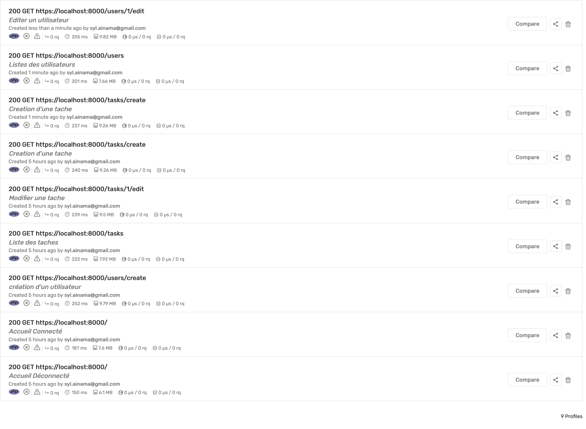

# Audit de performance

Audit de performance a été fait avec l'outil blackfire.

Il est possible d'optimiser le code:

- Optimiseur de composer
- Extension C pour Twig

Ici sont les différents liens pour les audits de performance:

- [Editer un utilisateur](https://blackfire.io/profiles/12063e92-5ba7-4e07-acbc-9f676fe0a5fa/graph)
- [Listes des utilisateurs](https://blackfire.io/profiles/81c5b0dd-eeea-4003-91f2-e9e845bd9328/graph)
- [Creation d'une tache](https://blackfire.io/profiles/7454e050-615d-4ce3-914f-bb2eb816b250/graph)
- [Modifier une tache](https://blackfire.io/profiles/d63de3c2-773a-4ace-b30f-34196eadf965/graph)
- [Liste des taches](https://blackfire.io/profiles/00d3aa63-707c-4ee9-91f5-dc89ced68f28/graph)
- [Creation d'un utilisateur](https://blackfire.io/profiles/1ae96e1b-8c17-4b77-81bd-c97f8b68eb46/graph)
- [Accueil Connecté](https://blackfire.io/profiles/99e3b954-23c7-4267-a008-a2da89ed4973/graph)
- [Accueil DéConnecté](https://blackfire.io/profiles/9d4c98ae-6a2c-476a-86d7-b9774d109b21/graph)