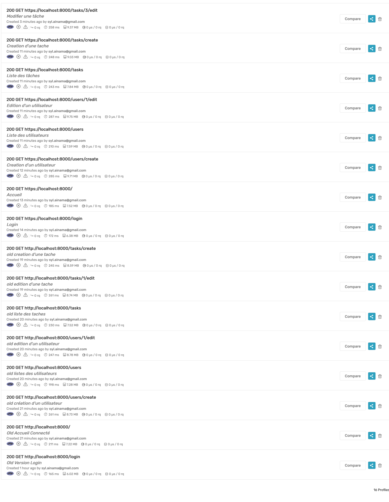
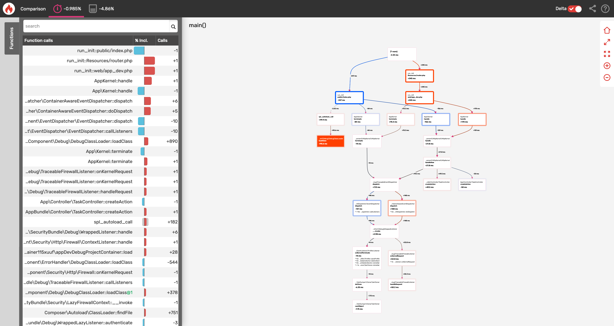
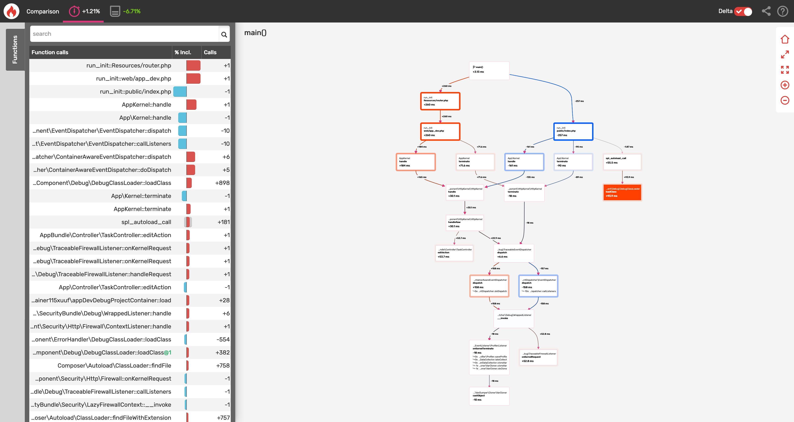
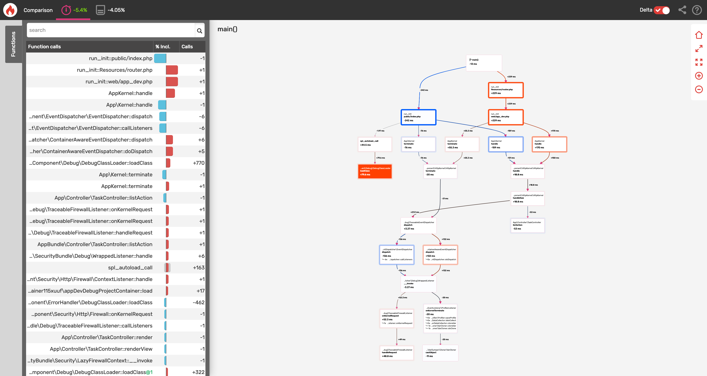
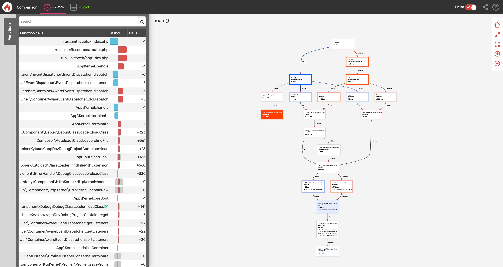
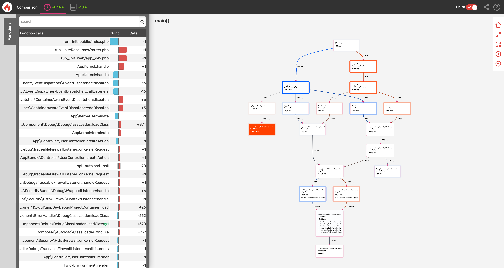
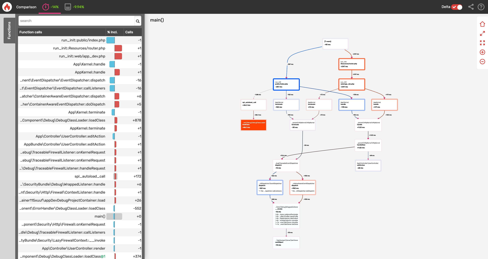
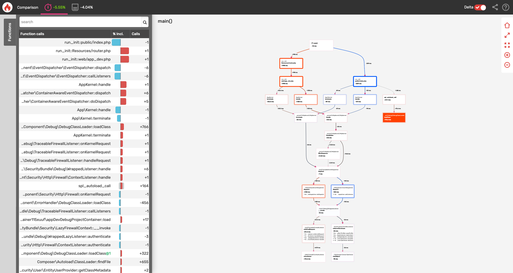

# Audit de performance

Audit de performance a été fait avec l'outil blackfire.

Il est possible d'optimiser le code:

- Optimiseur de composer
- Extension C pour Twig
- Dump-autoload

Ici **sont** les différents liens pour les audits de performance:

**Ancienne version**

- [Editer un utilisateur](https://blackfire.io/profiles/9abc8577-e4b1-4116-9375-672b4e5bc207/graph)
- [Creation d'un utilisateur](https://blackfire.io/profiles/ad07c118-306e-4565-ac0e-c167b103a413/graph)
- [Listes des utilisateurs](https://blackfire.io/profiles/16332616-9845-4a4f-9e39-9acbd553044f/graph)
- [Creation d'une tache](https://blackfire.io/profiles/3ae457b4-14bc-4bf4-89ea-23bae5e4720b/graph)
- [Modifier une tache](https://blackfire.io/profiles/8ee2cf81-0665-4ed3-99ca-fb587d9f4c64/graph)
- [Liste des taches](https://blackfire.io/profiles/08f23bdf-02da-4697-8e2a-916b4272f246/graph)
- [Accueil](https://blackfire.io/profiles/3eab9b8c-b5f4-4834-ab14-96c1da13e5b3/graph)
- [Login](https://blackfire.io/profiles/41c78f2f-b965-4576-bf5f-e9f0b9401c69/graph)

**Nouvelle version**

- [Editer un utilisateur](https://blackfire.io/profiles/b49c1bf8-ce0b-4097-9867-e36d84c302a7/graph)
- [Listes des utilisateurs](https://blackfire.io/profiles/6603ab44-6b8f-447c-8cbc-ebebf7411b33/graph)
- [Creation d'un utilisateur](https://blackfire.io/profiles/132a3d91-cda1-4d4e-a83c-d9903d5e9732/graph)
- [Creation d'une tache](https://blackfire.io/profiles/f972fbda-0039-4a23-b528-6c654a143351/graph)
- [Modifier une tache](https://blackfire.io/profiles/0677cc26-8bc1-4869-af09-519f151a0ac8/graph)
- [Liste des taches](https://blackfire.io/profiles/4345ea6b-f8b6-46fa-843c-4b84e221cc7f/graph)
- [Accueil](https://blackfire.io/profiles/fff98bdb-a107-4e64-946f-36d787e6fa45/graph)
- [Login](https://blackfire.io/profiles/c18588cd-b101-4b05-8114-777323fb42f1/graph)
  
## Comparaison

Creation d'une tâche

Edition d'une tâche

Liste des tâches

Login

Creation d'un utilisateur

Edition d'un utilisateur

Liste des users
